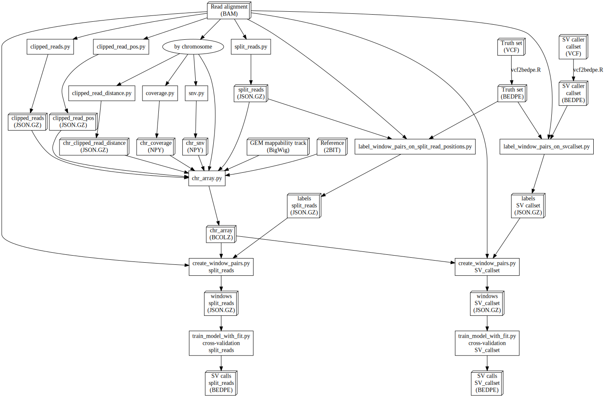

################################################################################
sv-channels
################################################################################

.. list-table::
   :widths: 25 25
   :header-rows: 1

   * - fair-software.nl recommendations
     - Badges
   * - \1. Code repository
     - |GitHub Badge|
   * - \2. License
     - |License Badge|
   * - \3. Community Registry
     - |Research Software Directory Badge|
   * - \4. Enable Citation
     - |Zenodo Badge|
   * - \5. Checklist
     - |CII Best Practices Badge|
   * - **Other best practices**
     -
   * - Continuous integration
     - |Travis CI|
   * - Documentation
     - |ReadTheDocs Badge|

(Customize these badges with your own links, and check https://shields.io/ or
https://badgen.net/ to see which other badges are available.)

.. |GitHub Badge| image:: https://img.shields.io/badge/github-repo-000.svg?logo=github&labelColor=gray&color=blue
   :target: https://github.com/GooglingTheCancerGenome/sv-channels
   :alt: GitHub Badge

.. |License Badge| image:: https://img.shields.io/github/license/citation-file-format/cff-converter-python
   :target: https://github.com/GooglingTheCancerGenome/sv-channels
   :alt: License Badge

.. |Research Software Directory Badge| image:: https://img.shields.io/badge/rsd-svchannels-00a3e3.svg
   :target: https://www.research-software.nl/software/sv-channels
   :alt: Research Software Directory Badge

.. |Zenodo Badge| image:: https://zenodo.org/badge/DOI/10.000/FIXME.svg
   :target: https://doi.org/10.000/FIXME
   :alt: Zenodo Badge

.. |CII Best Practices Badge| image:: https://bestpractices.coreinfrastructure.org/projects/sv-channels/badge
   :target: https://bestpractices.coreinfrastructure.org/projects/sv-channels
   :alt: CII Best Practices Badge

.. |Travis CI| image:: https://travis-ci.org/GooglingTheCancerGenome/sv-channels.svg?branch=iss32
   :target: https://travis-ci.org/GooglingTheCancerGenome/sv-channels
   :alt: Travis CI

.. |ReadTheDocs Badge| image:: https://readthedocs.org/projects/sv-channels/badge/?version=latest
    :alt: Documentation Status
    :scale: 100%
    :target: https://sv-channels.readthedocs.io/en/latest/?badge=latest

***********************
Documentation for users
***********************

Installation
============

.. code-block:: console

  git clone https://github.com/GooglingTheCancerGenome/sv-channels.git
  cd sv-channels
  conda update -y conda  # update Conda
  conda env create -n sv-channels -f environment.yaml
  conda activate sv-channels

Execution
=========

.. code-block:: console

  SCH=local  # gridengine or slurm
  ./run.sh $SCH data/test.bam 12,22 # run jobs locally or on a compute cluster

Flowchart
=========

Contributing
============

If you want to contribute to the development of *sv-channels*,
have a look at the `contribution guidelines <CONTRIBUTING.rst>`_.

*****************************
Documentation for maintainers
*****************************

*******
License
*******

Copyright (c) 2020, Netherlands eScience Center

Licensed under the Apache License, Version 2.0 (the "License");
you may not use this file except in compliance with the License.
You may obtain a copy of the License at

http://www.apache.org/licenses/LICENSE-2.0

Unless required by applicable law or agreed to in writing, software
distributed under the License is distributed on an "AS IS" BASIS,
WITHOUT WARRANTIES OR CONDITIONS OF ANY KIND, either express or implied.
See the License for the specific language governing permissions and
limitations under the License.
